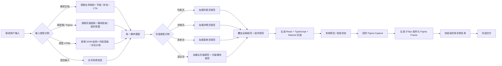

# Guazi Page Design Reference

## 1. Trigger Patterns

Use `$guazi-page-design` when the user wants any end-to-end flow like:

- "根据需求生成一个页面"
- "根据原型图生成一个页面"
- "根据 HTML 原型生成一个页面"
- "按规范把页面做出来"
- "页面做完后同步到 Figma"
- "从需求到代码再到 Figma"
- "代码生成回 Figma"

## 2. Default Execution Order

1. Identify the input source type
2. Parse the input into sections, modules, and CTAs
3. Identify the page type and dominant user goal
4. Load the matching rule stack
5. Implement the page in code
6. Run or reuse a local preview
7. Capture the page to Figma
8. Build a componentized Figma version with Guazi instances
9. Validate the final Figma nodes

## 3. Workflow Visualization

## 4. Input Source Rules

Always identify the user's input source first through `references/guazi-input-source-routing.md`.

Supported sources:

- requirement document
- prototype image or Figma page
- prototype HTML file

Conflict resolution order:

1. business logic -> requirement document
2. layout structure -> prototype image or HTML
3. visual and component rules -> Guazi style guide + Guazi component rules

## 5. Design Rule Source

Always use `$guazi-design-style-guide` as the style authority for:

- color
- radius
- typography
- spacing
- header behavior
- card behavior

Always use `references/guazi-component-usage.md` as the component authority for:

- which component to use
- component priority
- CTA hierarchy
- selection-control choice
- upload / input / switch placement

When the page has a top title bar or search header, also use `references/guazi-navbar-component.md` as the authority for:

- H5 vs mini-program routing
- title alignment choice
- search-header choice
- top-right action density

When the page has editable fields, also use `references/guazi-input-component.md` as the authority for:

- vertical vs horizontal field layout
- labeled vs no-label pattern
- suffix action selection
- helper text and validation-state usage
- password vs standard input routing

When the page has upload areas, also use `references/guazi-upload-component.md` as the authority for:

- single vs multiple upload routing
- upload-state handling
- wrapping vs single-line tile layout
- material grouping strategy

When the page has top-level or section-level switching, also use `references/guazi-tabs-component.md` as the authority for:

- normal vs tag vs card theme choice
- equal-width vs natural-width routing
- tab-count mapping
- tabs-with-content layout pairing

When the page has keyword search, also use `references/guazi-search-component.md` as the authority for:

- list-search vs search-navbar routing
- search style choice
- dropdown search scope usage
- explicit search action vs icon action

When the page has status chips, metadata tags, or selectable filter chips, also use `references/guazi-tag-component.md` as the authority for:

- `Tag 标签` vs `CheckTag 可选标签` routing
- neutral tag vs semantic tag choice
- tag size and density choice
- closable vs read-only tag choice

When the page has confirm popups, feedback popups, input popups, or image-led overlays, also use `references/guazi-dialog-component.md` as the authority for:

- confirmation vs feedback vs input vs image dialog routing
- horizontal vs vertical footer button layout
- close-button usage
- modal shell vs full-page flow choice

When the page has lightweight success/error/warning/loading feedback, also use `references/guazi-toast-component.md` as the authority for:

- row vs column toast routing
- neutral vs semantic toast choice
- loading toast usage
- toast vs dialog decision boundary

Do not invent a parallel page style if the Guazi guide already defines the answer.

Identify the dominant page type through `references/guazi-page-type-routing.md`.

If the page is a list page, also use `references/guazi-list-page-layout.md` as the layout authority for:

- tabs placement
- search and filter scaffold
- result summary row
- list-card density
- action-row hierarchy

When the page is a list page, also consult `references/guazi-standard-list-examples.md` to choose the nearest concrete pattern such as:

- operational order list
- finance/account card list
- lighter vs denser order-card variant

If the page is a detail page, also use `references/guazi-detail-page-layout.md` as the layout authority for:

- summary-card structure
- section ordering
- status / progress area
- evidence blocks
- sticky CTA behavior

When the page is a detail page, also consult `references/guazi-standard-detail-examples.md` to choose the nearest concrete pattern such as:

- proof / statement / certificate detail
- operational tool detail
- CRM / relationship detail
- single-CTA detail vs multi-action tool detail

If the page is a form page, also use `references/guazi-form-page-layout.md` as the layout authority for:

- field grouping
- field order
- labels and helper text
- upload blocks
- sticky submit area

## 6. Figma Rules For This Workflow

When pushing code back to Figma:

- always prefer an existing target file when the user already has one
- if the user only asks for "放到 Figma", HTML capture is acceptable as a first pass
- if the user asks for design-system correctness, create a second frame that reuses library instances
- the componentized frame must be `375px` wide
- use Guazi library instances for reusable controls whenever available

## 7. Componentization Priority

Try these first in the library:

- `NavBar 导航栏 - H5`
- `NavBar 导航栏 - mini program小程序`
- `Button 按钮`
- `Tabs 选项卡`
- `Input 输入框`
- `Switch 开关`
- `Avatar 头像`
- `Tag 标签`
- `CheckTag 可选标签`
- `Dialog 对话框`
- `Toast 轻提示`
- `item/tag`

If a matching component is missing:

- compose from Guazi primitives
- keep the Guazi tokens
- do not fake a library-backed component if it is not actually library-backed

For list pages, the componentized Figma frame should additionally try to reuse:

- `Tabs 选项卡`
- `item/tag`
- dense `Button 按钮` instances for per-item actions

## 8. Preferred Figma Output Pattern

Inside the target file, a good result often includes:

- one raw captured frame for visual parity
- one `375px` componentized frame for design-system reuse

Suggested names:

- `OrderDetailPage - Capture`
- `OrderDetailPage - DS`
- `ProfilePage - Capture`
- `ProfilePage - DS`

## 9. Final Hand-off Checklist

- input source is stated
- code path is clear
- preview URL is known
- page type is stated
- Figma file link is shared
- componentized Figma node link is shared
- user knows whether the Figma result is raw capture, componentized, or both
- if it is a list page, the hand-off should also confirm that the result follows the list-page layout reference on top of the base Guazi style guide
- if it is a detail or form page, the hand-off should also confirm that the result follows the matching page-pattern reference
